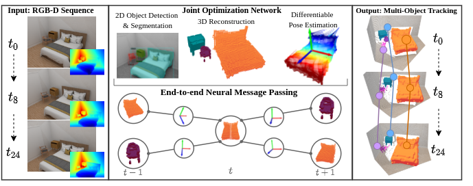

# 3D Multi-Object Tracking with Differentiable Pose Estimation

<p align="center"></p>
Our network leverages a 2D detection backbone with additional NOC prediction and 3D reconstruction heads to predict per-object dense correspondences maps and 7-DoF pose parameters. We leverage those correspondences in our neural message passing based, fully end-to-end learnable network to model dependencies between objects over time for consistent multi-object tracking


## Introduction
This a PyTorch implementation of our work "3D Multi-Object Tracking with Differentiable Pose Estimation".
In this project, we present a novel framework for 3D Multi-Object Tracking in indoor scenes.

Please check out the project website [3D_MOT](https://domischmauser.github.io/3D_MOT/).

## Dataset 
To download our novel 3D MOT dataset **MOTFront** consisting of 2381 unique indoor sequences, check out [Dataset](https://domischmauser.github.io/3D_MOT/).
Or use the direct download link [MOTFront](http://kaldir.vc.in.tum.de/dominik/MOTFront.zip).

## Setup 
To install network dependencies refer to **environment.yaml**.
We tested our code on a Linux / Ubuntu distribution.

## Paths
Refer to the **baseconfig.py** file for a general path setup. 
Store pre-trained Detection networks in the **Detection/model** directory and pre-trained Tracking networks in the **Tracking/model** directory.
Store MOTFront data in the **Detection/front_dataset** directory with subdirectories **train**, **val**, **test**. 
Store the **3D_front_mapping.csv** file in the **Detection/front_dataset** directory.


## Directories
We split the code into two main blocks, represented with two folders: **Detection** and **Tracking**.

Configurations for training the detection or end-to-end network can be set in the **cfg_setup.py** file. 
Configurations for training the tracking network can be set in the **options.py** and **graph_cfg.py** file. 

## Basic Usage
For training the 3D reconstruction and pose estimation pipeline independently, run the command: 
```
python train_net.py
```

For training the tracking pipeline independently, which:
- Requires inference results from the 3D reconstruction and pose estimation pipeline in a hdf5 format

Run the command: 
```
python train.py
```

For training our end-to-end network, set **eval_only = False** and run the command: 
```
python train_combined.py
```

For inference on the 3D reconstruction and pose estimation pipeline, which:
- Loads a pretrained network (best_model.pth) from the model folder
- Stores inference results in the predicted_data folder in a hdf5 format

Run the command: 
```
python inference_detector.py
```

For inference on our tracking pipeline, which:
- Loads a pretrained network (pretrained/edge_classifier.pth etc...) from the model folder
- Ensure to set --use_graph if you are using a pretrained network with graph 

Run the command: 
```
python inference.py
```

For inference on our end-to-end network, set the variables **eval_first = True** and **eval_only = True**: 
```
python train_combined.py
```


## Citation

If you use the MOTFront data or code in your work, please kindly cite our work and our paper:

```bibtex
@misc{https://doi.org/10.48550/arxiv.2206.13785,
  doi = {10.48550/ARXIV.2206.13785},
  url = {https://arxiv.org/abs/2206.13785},
  author = {Schmauser, Dominik and Qiu, Zeju and Müller, Norman and Nießner, Matthias},
  keywords = {Computer Vision and Pattern Recognition (cs.CV), FOS: Computer and information sciences, FOS: Computer and information sciences},
  title = {3D Multi-Object Tracking with Differentiable Pose Estimation},
  publisher = {arXiv},
  year = {2022},
  copyright = {Creative Commons Attribution 4.0 International}
}
```


